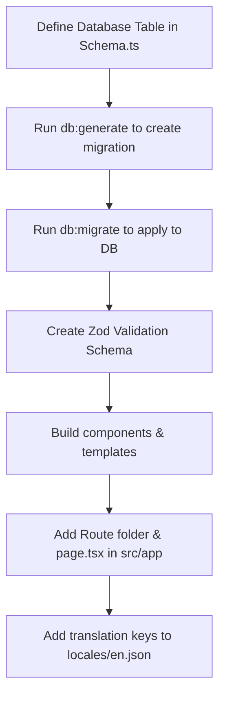

# Document 1: Comprehensive Boilerplate Overview & Architecture

Welcome to the ultimate guide to your Next.js starter boilerplate. This boilerplate is designed to provide you with a high-performance, fully configured development environment out-of-the-box. It prioritizes developer experience (DX), type-safety, and production readiness.

This guide provides a comprehensive breakdown of the application architecture, configuration, and layout conventions.

---

## 1. High-Level Architectural Philosophy

The boilerplate is engineered around several core software design principles:

- **App Router Paradigm**: Next.js App Router utilizes React Server Components (RSC) by default. This changes how we fetch data, layout components, and manage client-side state.
- **Type-Safety (End-to-End)**: TypeScript is integrated at every layer, including schema validation (Zod), environment variables (T3 Env), database queries (Drizzle ORM), and translations (next-intl).
- **Strict Separation of Concerns**: Pages (`src/app`) focus purely on routing and composing templates, whereas business logic resides in server utilities, ORM models, or custom client hooks.
- **Minimal JavaScript Payload**: Leveraging Server Components keeps the client-side bundle size minimal. Client components are explicitly opt-in via `"use client"`.

---

## 2. Directory and File Breakdown

Here is a complete mapping of the boilerplate's directory structure to help you find where everything is:

```
.
├── .github/                   # GitHub-specific files (Actions workflows, issue templates)
├── .storybook/                # Storybook configuration files
├── .vscode/                   # VSCode settings, tasks, and extension recommendations
├── migrations/                # Database migration SQL files (generated by Drizzle Kit)
├── public/                    # Static assets (images, fonts, favicons, robots.txt, sitemaps)
└── src/                       # Application source code
    ├── app/                   # Next.js App Router pages, APIs, and layouts
    │   ├── [locale]/          # Internationalization wrapper directory
    │   │   ├── (auth)/        # Authentication routes (Sign In, Sign Up)
    │   │   ├── (marketing)/   # Marketing pages (Home, About, Portfolio)
    │   │   └── layout.tsx     # Root locale-aware layout
    │   └── api/               # API Router endpoints (e.g. backend routes)
    ├── components/            # Reusable UI React components (forms, switchers, etc.)
    ├── libs/                  # Third-party library initializations & configurations
    │   ├── Arcjet.ts          # Security & rate limiting setup
    │   ├── DB.ts              # Database connection singleton
    │   ├── Env.ts             # Strict environment variable validation
    │   ├── I18n.ts            # next-intl configuration
    │   ├── I18nNavigation.ts  # i18n link and router wrapper utilities
    │   ├── I18nRouting.ts     # next-intl routing rules
    │   └── Logger.ts          # LogTape configuration (Better Stack integration)
    ├── locales/               # Key-value JSON translation files for multi-language support
    ├── models/                # Database schema definitions (Drizzle ORM)
    ├── styles/                # Global CSS stylesheet (Tailwind v4 entrypoint)
    ├── templates/             # Page layouts and skeletons (e.g. BaseTemplate)
    ├── types/                 # Custom global TypeScript types
    ├── utils/                 # General-purpose helpers and config parameters
    └── validations/           # Zod schema schemas for form and API validations
```

---

## 3. Detailed File Walkthrough

### 3.1. Routing & Layouts (`src/app/[locale]`)
Next.js uses folder-based routing. The `[locale]` folder is a dynamic route segment that captures the current language (e.g., `/en/dashboard`, `/fr/dashboard`).
- **`(marketing)` & `(auth)`**: Parentheses in folder names denote **Route Groups**. Next.js ignores these folders for routing paths, allowing you to organize pages and layout templates without affecting the URL path.
- **`layout.tsx`**: Defines the shared layout structure for a page subtree. It includes the HTML shell, standard headers, and sets up context providers (like `NextIntlClientProvider`).
- **`page.tsx`**: The entrypoint for each URL path. Renders the corresponding view.

### 3.2. Configuration Files (Root Directory)
- **`next.config.ts`**: The main configuration file for Next.js. In this boilerplate, it configures:
  - Strict mode and the React compiler (optimized for production).
  - Integrates `next-intl` localization.
  - Integrates Sentry for error tracking.
  - Controls bundle analyzing when compiling.
- **`drizzle.config.ts`**: Configures the Drizzle Kit tool. It tells Drizzle where to look for schemas (`src/models/Schema.ts`) and where to output migration scripts (`./migrations`).
- **`tsconfig.json`**: Configures TypeScript compiler options, including paths mapping `@/*` to `./src/*` for cleaner imports.

---

## 4. Crucial Configurations & Customization Points

When starting a new project with this boilerplate, customize these essential files:

1. **`src/utils/AppConfig.ts`**: Customize your product name, supported languages, default language, and routing rules here.
2. **Favicons & Metadata (`public/`)**: Replace `favicon.ico`, `favicon-16x16.png`, `favicon-32x32.png`, and `apple-touch-icon.png` with your branding.
3. **Global Styling (`src/styles/global.css`)**: Modify default styles, set up custom colors, and declare custom fonts or variables.

---

## 5. Development Workflow Step-by-Step

To build features using this boilerplate, follow this pattern:



1. **Database Schema**: Declare schemas using Drizzle in `src/models/Schema.ts`.
2. **Migrations**: Run `npm run db:generate` to produce the SQL. Apply using `npm run db:migrate`.
3. **Data Validation**: Create a Zod schema in `src/validations/` for incoming forms/APIs.
4. **UI Components**: Create components in `src/components/`. If you are developing a complex component, use Storybook to construct it in isolation.
5. **Connecting Routes**: Create pages inside `src/app/[locale]/` to display the UI and bind the data fetching logic.
6. **Localization**: Write all user-facing strings in the `locales/*.json` files to ensure they translate correctly.

---

Next, proceed to **Document 2** to study the specific packages, tools, and integrations that drive this system.
